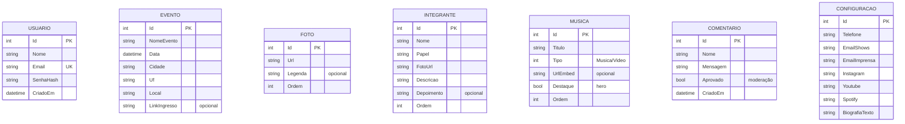

# DER — Grupo Zero 14

Diagrama Entidade-Relacionamento do site institucional do **Grupo Zero 14** (cliente Nebula).

- **Banco:** SQL Server (EF Core, provider-agnóstico)
- **Autenticação:** 1 usuário admin único (criado por seed), JWT
- **Comentários:** com moderação (nascem `Aprovado = false`)
- **Galeria, Músicas e Integrantes:** ordem manual via campo `Ordem`
- **Fotos e Integrantes:** o admin faz upload do arquivo; a API salva e grava só o caminho em `Url`/`FotoUrl`
- **Tabelas independentes** (sem FKs) — modelo tipo CMS

## Diagrama

## Dicionário de dados

### USUARIO
Único registro (seed). Serve para login no painel e edição do próprio perfil (email/senha).

| Campo | Tipo | Observação |
|-------|------|------------|
| Id | int (PK) | |
| Nome | string | |
| Email | string (UK) | único |
| SenhaHash | string | hash BCrypt |
| CriadoEm | datetime | |

### EVENTO — Agenda de shows
| Campo | Tipo | Observação |
|-------|------|------------|
| Id | int (PK) | |
| NomeEvento | string | |
| Data | datetime | |
| Cidade | string | |
| Uf | string | |
| Local | string | |
| LinkIngresso | string | opcional |

### FOTO — Galeria
| Campo | Tipo | Observação |
|-------|------|------------|
| Id | int (PK) | |
| Url | string | |
| Legenda | string | opcional |
| Ordem | int | ordenação manual na vitrine |

### INTEGRANTE — Membros do grupo (biografia)
Alimenta os cards de integrantes e o carrossel de depoimentos na página de biografia.

| Campo | Tipo | Observação |
|-------|------|------------|
| Id | int (PK) | |
| Nome | string | |
| Papel | string | função / instrumento (ex: "Voz e violão") |
| FotoUrl | string | caminho da foto (upload via painel) |
| Descricao | string | mini-bio exibida no card |
| Depoimento | string | opcional — frase do carrossel |
| Ordem | int | ordenação manual dos cards |

### MUSICA — Músicas e vídeos
| Campo | Tipo | Observação |
|-------|------|------------|
| Id | int (PK) | |
| Titulo | string | |
| Tipo | int (enum) | Musica / Video |
| UrlEmbed | string | opcional (embed YouTube/Spotify) |
| Destaque | bool | destaque no hero ("Assista agora") |
| Ordem | int | ordenação manual |

### COMENTARIO — Recados dos fãs (com moderação)
| Campo | Tipo | Observação |
|-------|------|------------|
| Id | int (PK) | |
| Nome | string | |
| Mensagem | string | |
| Aprovado | bool | default `false`; admin aprova para exibir |
| CriadoEm | datetime | |

### CONFIGURACAO — Dados de contato/rodapé (linha única)
| Campo | Tipo | Observação |
|-------|------|------------|
| Id | int (PK) | |
| Telefone | string | |
| EmailShows | string | |
| EmailImprensa | string | |
| Instagram | string | |
| Youtube | string | |
| Spotify | string | |
| BiografiaTexto | string | texto da biografia, editável pelo admin |

## Paleta de cores (PRINCIPAL)

| Cor | Hex |
|-----|-----|
| Azul elétrico | `#1E44E8` |
| Amarelo/dourado | `#F5C518` |
| Verde | `#22E06A` |
| Vermelho | `#E8241C` |
| Azul-ardósia | `#3E4A6B` |
| Verde-petróleo | `#3E7A5E` |
