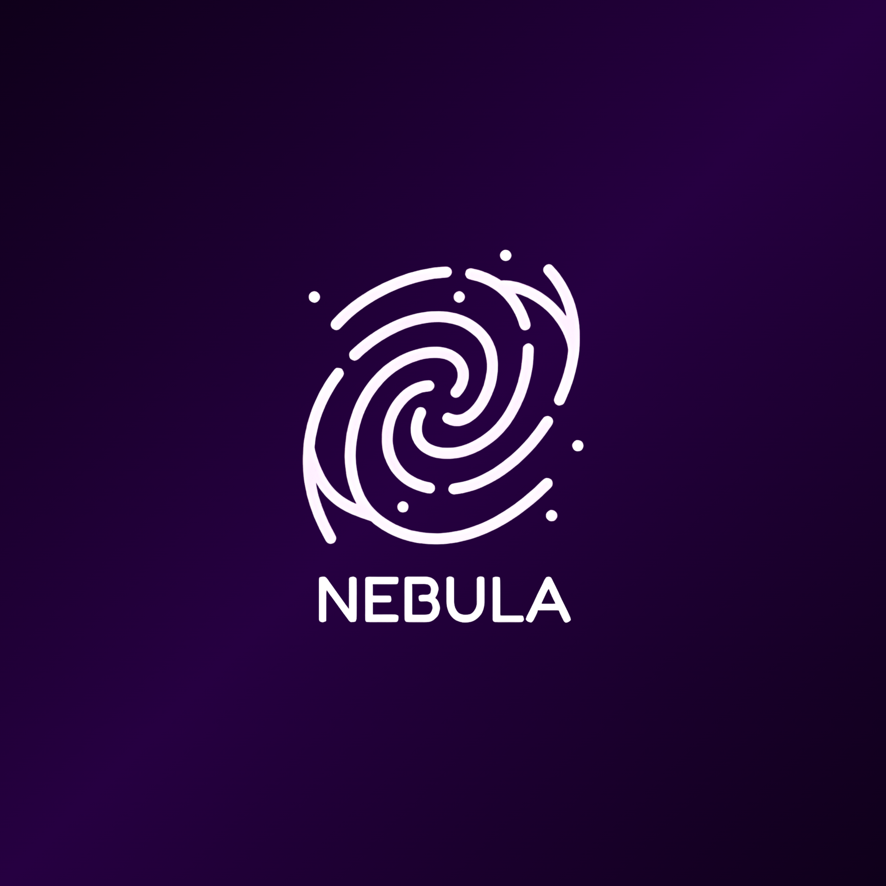
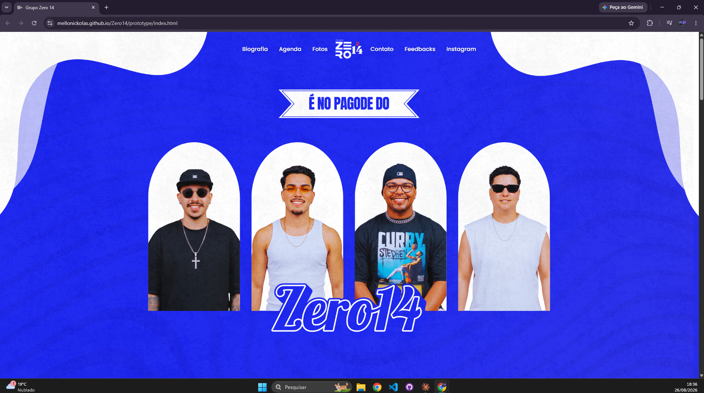
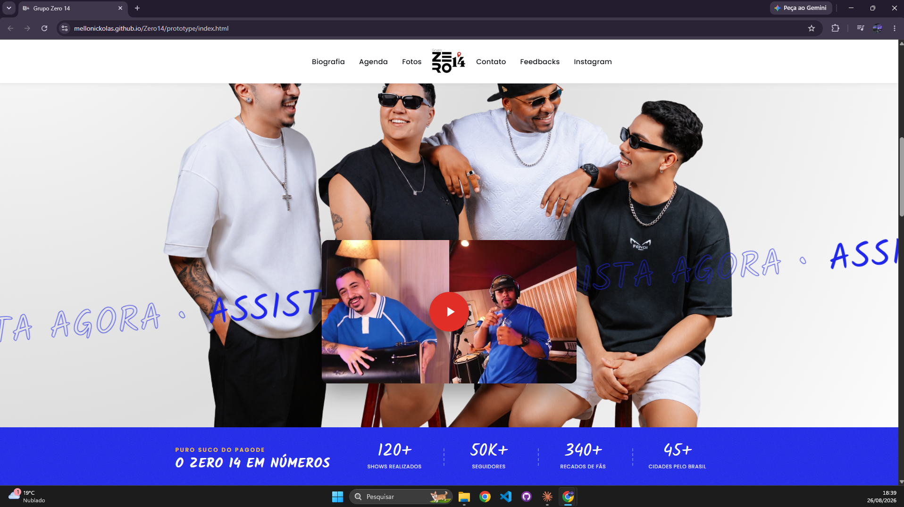
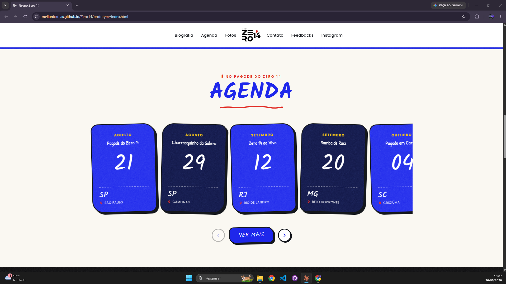
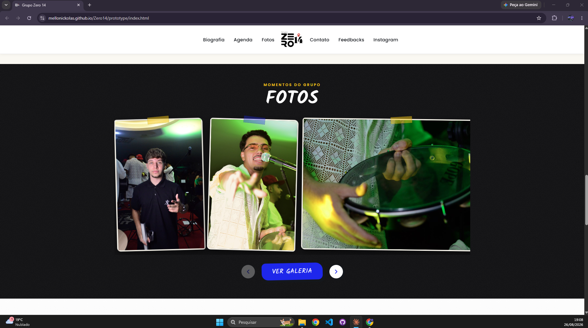
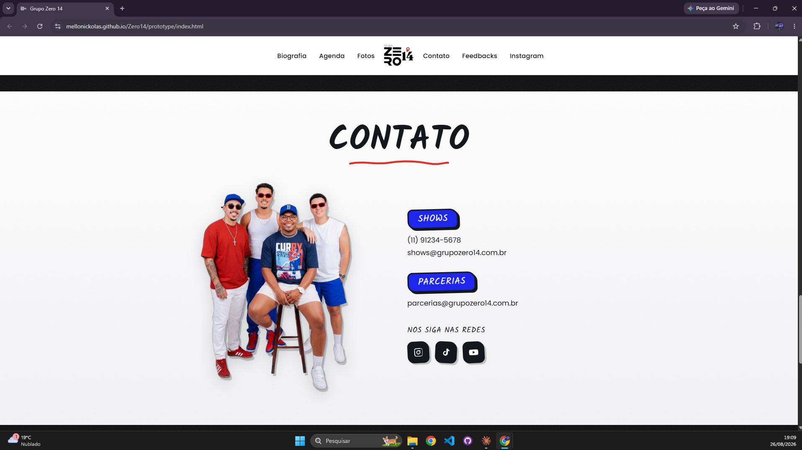
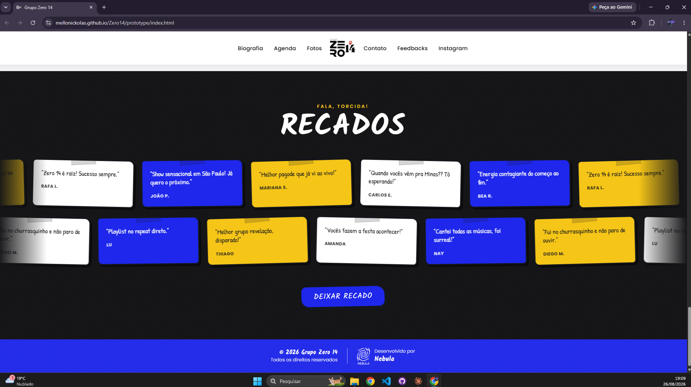
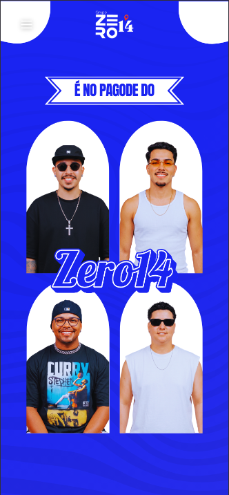
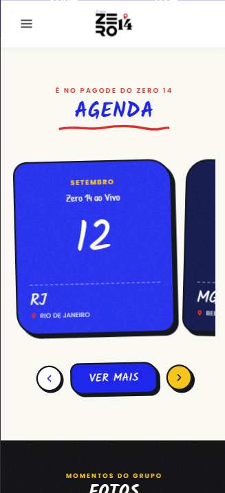

<p align="center">
  
</p>

<h1 align="center">Grupo Zero 14</h1>

<p align="center">
  Site institucional do grupo de pagode <strong>Zero 14</strong> — desenvolvido pela agência <strong>Nebula</strong>.
</p>

<p align="center">
  
  
  
  
</p>

---

## 📖 Sobre

Site institucional do **Grupo Zero 14** com um **painel administrativo** para o próprio grupo manter o conteúdo (agenda de shows, galeria de fotos, músicas/vídeos, dados de contato e moderação de recados dos fãs).

O visual segue um estilo **"sketch / desenho a giz"** — traços de marcador, sombras duras tipo adesivo, textura de grão e a paleta oficial do grupo.

> **Status atual:** protótipo estático aprovado ✅ — iniciando a implementação da aplicação real (front React + back .NET).

## 🎬 Preview

🔗 **Protótipo ao vivo:** [mellonickolas.github.io/Zero14/prototype](https://mellonickolas.github.io/Zero14/prototype/index.html) · Código em [`prototype/`](prototype/) · Vídeo: [`README-Assets/Video-Prototype.mp4`](README-Assets/Video-Prototype.mp4)

### Home







### Responsivo (mobile)
<p align="center">
  
  
</p>

## ✨ Funcionalidades

### Site público
- **Home** — hero, vídeo em destaque ("Assista agora"), números do grupo, prévia da agenda, prévia da galeria, contato e mural de recados
- **Shows** — agenda completa dos próximos shows, agrupada por mês
- **Biografia** — história do grupo, integrantes e depoimentos
- **Galeria** — fotos em masonry com lightbox
- **Recados** — fãs deixam mensagens (entram para moderação antes de aparecer)

### Painel administrativo
- Login com **JWT** (usuário admin único, criado por seed)
- Edição do próprio perfil (e-mail / senha)
- CRUD de **eventos**, **fotos** e **músicas/vídeos**
- **Moderação de recados** (aprovar / recusar)
- Edição dos **dados de contato** do rodapé

## 🛠️ Stack

**Frontend**
- Vite + React + TypeScript
- Tailwind CSS
- Fontes: Kalam (display), Patrick Hand (manuscrito), Poppins (corpo)

**Backend** (arquitetura em camadas, baseada no padrão [TaskFlow](https://github.com/MelloNickolas/TaskFlow))
- .NET 9 (Web API)
- Entity Framework Core + SQL Server
- Autenticação JWT
- BCrypt para hash de senha

## 🗂️ Estrutura do repositório

```
Zero14/
├── frontend/                    # Vite + React + TS + Tailwind
│   ├── src/
│   │   ├── pages/               # Home, Shows, Biografia, Galeria
│   │   ├── components/          # Navbar, Footer, ShowCard, etc.
│   │   ├── assets/              # imagens otimizadas
│   │   ├── styles/              # tokens da paleta + fontes
│   │   └── client/             # cliente HTTP para a API
│   └── ...
│
├── backend/                     # Solution .NET 9 em camadas
│   ├── Zero14.sln
│   └── src/
│       ├── Zero14.Domain/       # entidades do DER + enums
│       ├── Zero14.Repositories/ # DbContext (EF Core), repositórios, Migrations
│       ├── Zero14.Application/   # DTOs, interfaces dos serviços
│       ├── Zero14.Services/      # regras de negócio
│       └── Zero14.API/          # Controllers, JWT, seed do admin
│
├── prototype/                   # protótipo estático (referência)
├── README-Assets/               # DER, vídeo e screenshots
└── README.md
```

Fluxo de dependência: `API → Services → Application → Repositories → Domain` (o Domínio não depende de nenhuma outra camada).

## 🧩 Modelo de dados (DER)

Seis tabelas independentes (modelo tipo CMS). Documentação completa e diagrama em **[`README-Assets/DER.md`](README-Assets/DER.md)**.

| Tabela | Papel |
|--------|-------|
| `USUARIO` | Admin único (seed) — login e edição de perfil |
| `EVENTO` | Agenda de shows |
| `FOTO` | Galeria (ordem manual) |
| `MUSICA` | Músicas e vídeos (destaque no hero) |
| `COMENTARIO` | Recados dos fãs (com moderação) |
| `CONFIGURACAO` | Dados de contato / rodapé (linha única) |

## 🎨 Identidade visual

**Paleta principal**

| | Cor | Hex |
|---|-----|-----|
| 🔵 | Azul elétrico | `#1E27EB` |
| 🟡 | Amarelo | `#F5C518` |
| 🔴 | Vermelho | `#E12E27` |
| 🟢 | Verde | `#22C55E` |
| ⚫ | Tinta (contorno) | `#14171C` |

**Tipografia**

- **Kalam** — títulos / display
- **Patrick Hand** — detalhes manuscritos
- **Poppins** — corpo de texto

## 🚀 Como rodar

> As instruções abaixo valem conforme cada parte for sendo implementada.

**Protótipo** (já disponível)
```bash
cd prototype
python -m http.server 8080
# abra http://localhost:8080
```

**Frontend** _(em breve)_
```bash
cd frontend
npm install
npm run dev
```

**Backend** _(em breve)_
```bash
cd backend
dotnet restore
dotnet run --project src/Zero14.API
```

## 👥 Créditos

Desenvolvido por **Nebula** para o **Grupo Zero 14**.
